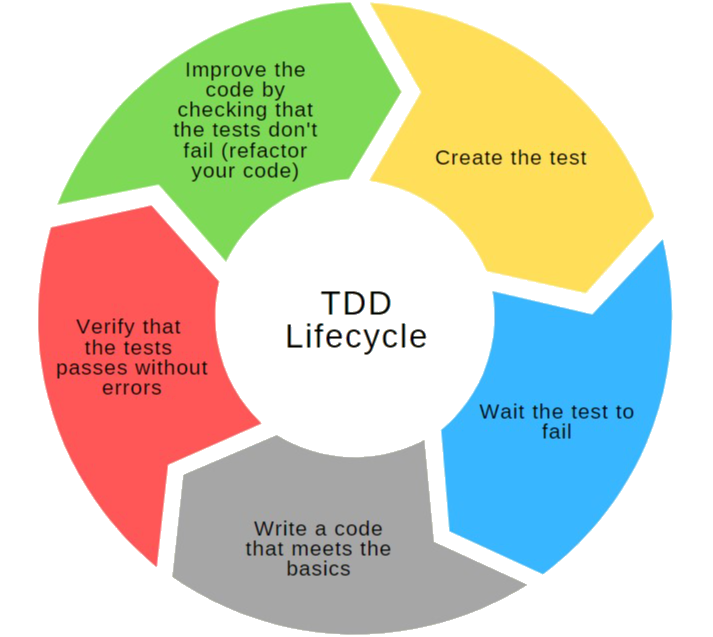
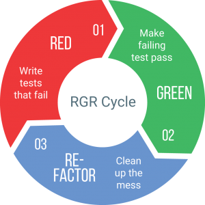

# Test Driven Development

## What is Test Driven Development (TDD)?

It is a development methodology that suggests creating the tests before making the code of the applications to be able to have all the necessary testing of them ready and thus know if the applications work and, above all, and much better, than if improvements are applied to them. , or are modified or refactored, it is possible to avoid problems in the future.

## How to create tests before creating Software?

If there is no software to test, how to test?

The TDD methodology suggests life cycles in order to apply it correctly to software development.

## Normal flow of software development
The normal flow of software development is composed of the stages detailed below:

1. Gathering of requirements.
2. Software design
3. Software development
4. Tests

    + Infinite cycle between points 3 and 4; Here it is considered as a repetition cycle, which is not something that helps to improve the software but, on the contrary, delays the development stage. And worse yet, when it goes into production, something goes wrong. Example: This already works, so do this another test. Well, it was improved, but if this damages another? it's time to upgrade it again, and so on.
5. Output to production
    + Froduction failure.

## Flow of software development based on TDD

1. Gathering of requirements
2. Software design
3. TEST DEVELOPMENT

    Before software development, tests are developed. Here, in the tests, is the place to place a set/set of tests that allow you to analyze whether the software that has been created works correctly and meets the established requirements.

4. Software development
    + Finite cycle between points 3 and 4 (finite cycle because it is considered an organized and documented set of tests and once the tests have been passed, it can go out to production.)
    + Continuous improvement and refactoring of the code. Here the tests have passed successfully and it is possible to go to production since everything is working.

5. Output to production
    + Happiness of the client, tester, developer, etc.

### Advantages

+ Continuous improvement of the code without having to worry about damaging something, which allows the code to be refactored at any time since there are tests that will validate if that refactoring worked or not.
+ Always keep the documentation of the code up to date (seeing it from the point of view of reading the code). Not from the point of view of the documentation that they are made with comments when they indicate the function that one or another line of code fulfills. This refers to the technical documentation of how it works or what the code does.
+ Reduce time to production. (Beware, not development time) Development time is the time spent developing the software. When the previously written tests have passed, the output to production is much simpler.
+ Automated tests on the code side. Set of acceptable tests for the requirements and if they pass it is automating that process because it only executes a couple of commands and checks if your code worked or not.

#### More advantages:
**Executable documentation**:
In the vast majority of cases, seeing the tests allows us to understand the objective of the code or the function that is being tested.

**No debugging**:
Generally no need to debug applications as you can easily tell where a bug is. That is, if it fails a test, you must correct the process that is failing the test until it passes.

**Clean code**:
With clean code, the ability to create functions that really fulfill a single objective improves. That is, you should not do more than you need to.

TDD is having tests on specific functions.

## Types of testing

### Black-box Testing

Also known as _Functional Testing_ and is characterized in that the tests are performed on the already built application interface.

In other words, being able to have designed a database, being able to have designed the backend and being able to have the frontend designed and only until this entire development cycle is finished, can a user gain access to test the application, although only It does it on the interface in addition to not knowing how everything works behind the scenes.

#### Advantages of black box testing

The person who performs the test or who performs the testing in this type of black-box Testing does NOT need to know how the application works, they do NOT have to have technical development knowledge.

#### Disadvantages of black-box testing

You have to wait for the entire development cycle to be finished to run the program and test it.

It is valid, it works and it must be done, but for TDD another type of Testing is necessary.

### White-box Testing
Also known as _Structural Testing_, and it is a type of testing where the test is performed on the internal structure of the software, in addition technical development skills are required to perform these tests. There is a database of tests and expected results. The tests are carried out by throwing code and the tests are created with code, that is, the person must know how the system works inside.

The person who performs this type of Testing must recognize the methods, parameters to be sent, which is what is received in order to perform the tests that must be successfully passed by the software being developed.

#### Advantages of white-box testing

It allows having automated tests because it is possible to create a large test set, that is, a database with several tests that must pass and since it is automated, only one or two commands are executed to test that the software is working correctly.

#### Disadvantages of white-box testing

A tester without technical development skills will not be able to perform this type of test since it is necessary to know how to develop to create the test.

## TDD Lifecycle

<center>
    
</center>

1. Create the test
2. Wait for the test to fail. The test should fail as no software has been written. Depending on the programming language, tests can be created without the structure or skeleton of the software to be executed even existing.

    For example, in GO, Java or C sharp, which are highly typed programming languages, they require that if a function is called, the latter must exist. So, you have to have a skeleton that even if it doesn't do anything, or at least doesn't return the correct information, it has to exist in order to create the tests.

    So, it is necessary to create the skeleton, create the tests and wait for it to fail. Be careful, the test should fail only because it did not return the expected result, not because of a compilation error.

3. Write code that meets the basics | This code must meet the basic requirements of the test to pass, but it must be the least amount of code possible. Write the code and wait for it to happen.

4. Wait for the test NOT to fail. | Verify that the test passes without errors.

5. Refactor the code | Improve the code checking that the tests do not fail.

    Be careful, if you do not refactor the code you are NOT really applying TDD, what you do is write the tests first. It's good? it is bad? Generally, not all features require TDD, because there may be some features that are too simple, for example; adding two numbers and returning their result and refactoring a sum would be quite tricky.

    So, we always have to find a way to refactor our code to improve it.

**Important**: If you do not comply with the mentioned life cycle, you are NOT performing TDD, but only test development first.

Summary TDD Lifecycle:
+ 1st. create test
+ 2nd. wait for it to fail
+ 3rd. write the code to pass the test
+ 4th. wait for it not to fail, that is, for it to happen and finally
+ 5th. refactor.

## Red/Green/Refactor Cycle (RGR Cycle)

<center>
    
</center>

This cycle is known as such because most of the testing tools, when a test fails it is identified in red, when it passes it is identified in green and obviously it will have to be refactored.

```
Test fails: RED
Test passes: GREEN
Refactor
```

### Tests must fail

This life cycle has to be fulfilled, that is, it must always fail the test initially. It is not correct to write a test that does not fail. Therefore, it is necessary to write the basic code so that the test compiles but does not return the correct thing. That is, to fail.

_Be careful, the test should not fail due to compilation, but rather it fails because it returns a result that is not the expected one._

### Tests should pass

After the tests failed, it is required to write the code and make the tests pass. They can NOT fail.

### Improve the code and the tests keep passing

Refactor to improve the code, make it more efficient, whatever it takes to improve the code. But when refactoring YES they must pass the tests because they have already passed them previously.