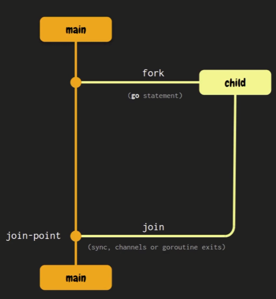

# Concurrency with Go

## Parallelism and Concurrency

### Parallelism

+ When you make lot of tasks simultaneously but consuming more computing power.

### Concurrency

+ When you make various tasks at the same time.

## Go routines and the "Fork-Join" Model

### Go routine

It is just a function or method that runs independently concurrently in the same address space with other goroutines.

To create a go routine you just need to add `go` to your function.

Example:
```go
go myFunction()
```

### Fork-join model


Very similar as how git works.

Every go project that you create have at least 1 go routine which is the main go routine, created automatically. When you execute `go run main.go` you are executing your go routine `main`.

+ **Fork** means that at any point in the program, it can divide to a child execution branch so it can be executed along with the father go routine (main go routine).
+ **Join** means that at any point in the future, we don't know when, the concurrent execution branches will join again in something called _join-point_.

How can we synchronize the _join-points_? To sync them we need to sync the father go routine with the child one, with some primitive packages like the `sync` package.

## Two Approaches to Work With Concurrency

### Low level concurrency (Traditional approach)

+ Syncs the memory access.
+ Sync package
    + Wait Group
    + Mutex
+ No need of communication
    + We only want to ensure that a group of goroutines finalize their execution. (WaitGroup).
    + We only want to ensure that only one goroutine can access to one variable at a time to avoid confilcts (Mutex).

### High level concurrency (CSP Model - communication of secuential processes)

+ Sharing the memory by communication.
+ Channels
    + Range and Close
    + Select
+ Great for communication between goroutines.

## Concurrency Problems: Data Race

Occurs when two goroutines access to the same variable at the same time and at least one have read access.

Example:
```go
func main() {
    data := 1

    go func() {
        data++
    }()

    fmt.Println(data)
}

// The go routines race to access to the data variable
```

How to solve this problem? Lock the access to the variable, so the first go routine can lock the variable and then the second go routine can access to the variable.

## Concurrency Problems: Race Condition
This problem occurs when two or more operations have to be executed in the correct order, but the program hasn't been written ensuring it maintains this order.

Example
```go
func transfer(amount int, source, dest *account) {
    if source.balance < amount {
        return
    }

    dest.balance += amount
    source.balance -= amount
}
```

## Concurrency Problems: Deadlock
This problem occurs when a group of go routines waits for each other and none of them can continue.

Example:
```go
func main() {
    message := make(chan string)

    go func() {
        fmt.Println(<-message)
    }()

    fmt.Println(<-message)
}
```

Solution:
```go
func main() {
    message := make(chan string)

    go func() {
        message <- "Hello!"
    }()

    fmt.Println(<-message)
}
```

## Concurrency Problems: Livelock

They are programs that actively perform concurrent operations, but these operations do nothing to advance the state of the program.


## Starvation

It is a situation where a concurrent process cannot get regular access to the resources it needs to do its job and cannot progress.

This happens when there are one or more greedy concurrent processes unfairly preventing one or more concurrent processes from doing work as efficiently as possible, or perhaps not allowing them to do their work.
